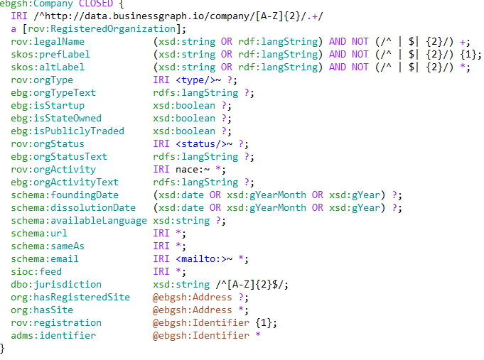
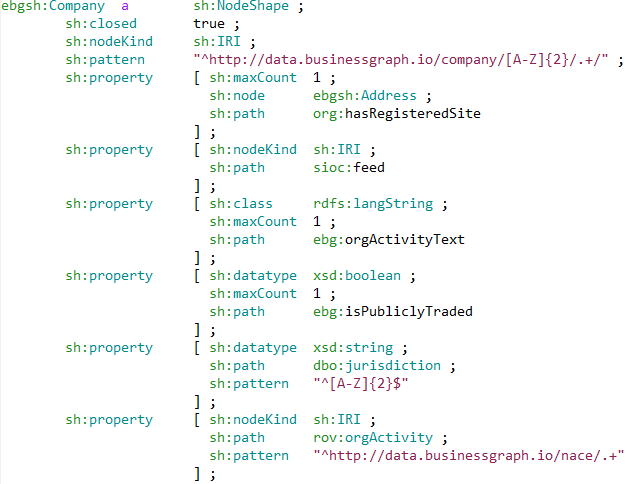
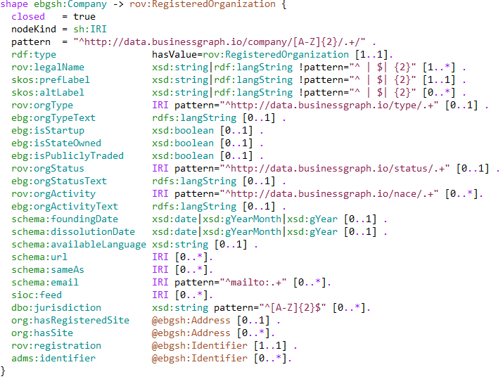
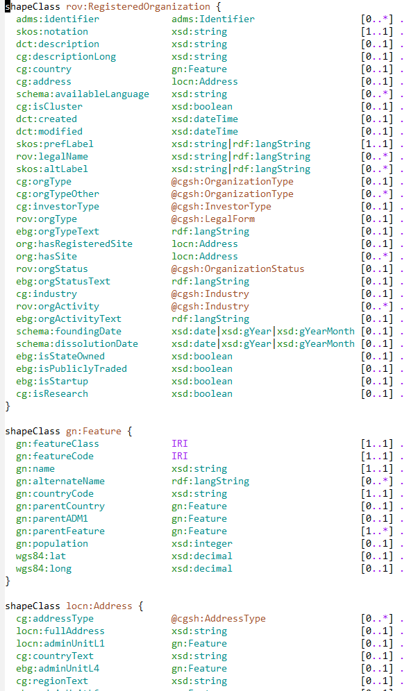
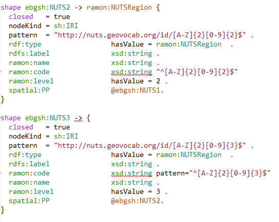
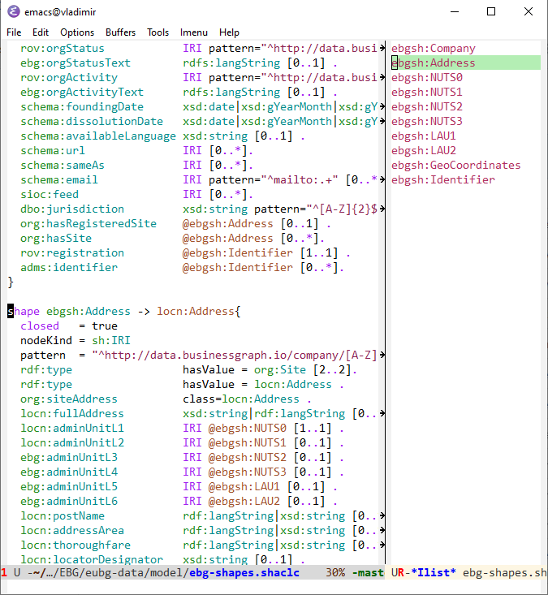

# Editing SHACLC with shaclc-mode

- Source: https://github.com/VladimirAlexiev/shaclc-mode
- Author: Vladimir Alexiev, Ontotext Corp

## Intro

Many people think that semantic models should be described with RDF Shapes, not just ontologies.
[SHACL](https://www.w3.org/TR/shacl/) is the W3C standard for specifying shapes, and [SHEX](http://shex.io/) is a popular competitive standard.

SHACL is very verbose because it expresses shapes as RDF triples.
[SHACL Compact Syntax](https://w3c.github.io/shacl/shacl-compact-syntax/) (SHACLC) is a dedicated syntax modeled after SHEX that is a lot more compact and nicer to work with.

Just like there is [shexc-mode](https://github.com/ericprud/shexc-mode-for-emacs) for editing SHEX in Emacs,
this creates a `shaclc-mode` (in fact this mostly borrows from `shexc-mode`).

## Why SHACLC?

The easiest way to understand the benefits of SHACLC compared to SHACL is by looking at some example shapes from the [euBusinessGraph semantic model](https://github.com/euBusinessGraph/eubg-data/tree/master/model):

- SHEX has a compact dedicated syntax (in addition to JSON and RDF representations): see [ebg-shapes.shex](https://github.com/euBusinessGraph/eubg-data/blob/master/model/ebg-shapes.shex), 143 lines



- SHACL is very verbose because all constructs are represented in triples: see [ebg-shapes.shacl](https://github.com/euBusinessGraph/eubg-data/blob/master/model/ebg-shapes.shacl), 504 lines (the shot below shows only 6 properties of Company)



- SHACLC adds a compact dedicated syntax, so SHACLC schemas are easy to understand: see [ebg-shapes.shaclc](https://github.com/euBusinessGraph/eubg-data/blob/master/model/ebg-shapes.shaclc), 183 lines (35 lines are prefixes)



## Features

- Syntax highlighting



- Syntax checking using `shaclconvert` and `flycheck`



- Comment/uncomment block with `M-;`
- Index of shape definitions (`imenu`) and panel on the right (`imenu-list`)



## Installing

- Optionally, byte compile `shaclc-mode.el`
- Add this to `.emacs`

```elisp
(add-to-list 'load-path "{path-to-shaclc}")
(autoload 'shaclc-mode "shaclc-mode" "Major mode for SHACLC (SCHACL Compact Syntax)" t)
(add-to-list 'auto-mode-alist '("\\.\\(shaclc\\|shc\\)$" . shaclc-mode))
```

- Syntax validation is implemented using `flycheck` and the [shaclconvert](https://gitlab.ontotext.com/yasen.marinov/shaclconvert) tool.
  - It is not open sourced yet but we hope to merge it to TopQuadrant SHACL soon.
  - Talk to me if you want to use it now

## Todo

- Make an ELPA package
- Use [SHACLC.g4](https://github.com/w3c/shacl/blob/master/shacl-compact-syntax/SHACLC.g4) grammar to make highlighting better
- Merge `shaclconvert` to [TopQuadrant SHACL](https://github.com/TopQuadrant/shacl/)
- Fix bugs in `shaclconvert` reading and writing
- Make SHACLC (see [TopQuadrant/shacl#98](https://github.com/TopQuadrant/shacl/issues/98)) nearly lossless so it can be round-tripped with SHACL

Help wanted!

